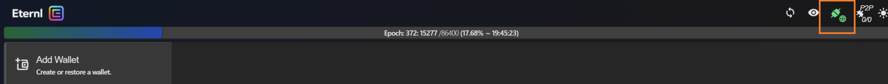

# Welcome to LoyalT

## How to Connect
1. Choose from the various Cardano Wallets and download the browser extension:

    |         |                                        |
    |---------|----------------------------------------|
    | Eternal | https://ccvault.io/app/mainnet/welcome |
    | Lace    | https://www.lace.io/                   |
    | Nami    | https://namiwallet.io/                 | 

    Note: These are just some of the popular Cardano wallets, you can choose any other which you like but should be compatible with Cardano.

2. Currently the application leverages Cardano Testnet, so make sure that the wallet account you create is on **testnet network**.

3. Look for the **DApp intgration** option in your wallet which will allow you to integrate your wallet to the websites. (Latest wallets like Lace will automatically idnetify your application and will ask you to authorize it before integrating the wallet).
    